# Remember-Note

## 介绍


`Remember-Note` 是一款在线静态站点编辑器 + 个人笔记的笔记系统。

## 功能

- [x] 支持 Markdown 所见即所得；
- [x] 支持一键粘贴复制文章到微信公众号、知乎以及掘金；
- [x] 支持插入图片、视频，插入图片时会自动进行压缩转码；
- [x] 支持和一些开源的静态站点博客系统结合实现一键发布博客，比如 hexo、hugo 等；
- [x] 集成了一个 AI 功能，生成文章的 description；
- [x] 发布到静态站点时支持文章 Tag；
- [ ] 支持导入导出；
- [ ] 图片上传支持自定义图床，默认上传至服务器；

## 源码运行

### 运行环境

- Node.js 16.14.0 或以上；
- 前端使用 Vue3 + Vite + TypeScript；
- 后端使用 Koa + TypeScript；
- 数据库使用 MongoDB，请安装 4.4.13 版本的 MongoDB 数据库；

### 拉取代码

```bash
git clone https://github.com/foxhsx/remember-note.git

cd remember-note/
```

### 安装并启动数据库
```bash
homebrew install mongodb-community@4.4

sudo /opt/homebrew/opt/mongodb-community@4.4/bin/mongod --dbpath /opt/homebrew/var/mongodb/data/db
```

### 启动前端服务

```bash
cd note/

npm install

npm run dev
```

### 启动后端服务

```bash
cd server/

npm install

npm run start
```

全部启动后，在浏览器可以通过 `ip + 5173` 进行访问。

## Docker 部署

### 拉取项目

```bash
git clone https://github.com/foxhsx/remember-note.git

cd remember-note/

cd docker/
```

### 配置环境变量

在项目根目录下，找到 `.env` 文件，修改其中的环境变量。环境变量说明：

| 环境变量 | 说明 |
| --- | --- |
| **Github 仓库配置** | |
| GITHUB_REPO_URL | 静态站点的 Github 仓库地址 |
| GITHUB_REPO_NAME | 项目名称 |
| GITHUB_REPO_CONTENT_PATH | 博客文章存放路径 |
| GIT_USER_NAME | Git 用户名 |
| GIT_USER_EMAIL | Git 用户邮箱 |
| **应用程序配置** | |
| NODE_ENV | 运行环境（development/production） |
| TIMEZONE | 时区设置 |
| **服务器配置** | |
| SERVER_PORT | 服务器端口 |
| SERVER_HOST | 服务器主机地址 |
| **API 密钥配置** | |
| TINIFY_API_KEY | Tinify 图片压缩服务 API 密钥 |
| OPENAI_API_KEY | OpenAI API 密钥 |
| OPENAI_BASE_URL | OpenAI API 基础 URL |
| OPENAI_MODEL | OpenAI 使用的模型 |
| **阿里云 OSS 配置** | |
| ALI_OSS_REGION | OSS 地域节点 |
| ALI_OSS_ACCESS_KEY_ID | OSS AccessKey ID |
| ALI_OSS_ACCESS_KEY_SECRET | OSS AccessKey Secret |
| ALI_OSS_BUCKET | OSS Bucket 名称 |
| ALI_OSS_SECURE | 是否使用 HTTPS

### 构建镜像
进入到 docker 目录下，执行以下命令：

```bash
cd docker/

docker compose up -d
```

容器启动后在浏览器通过 `ip:8080` 访问即可。

## 项目截图

笔记首页

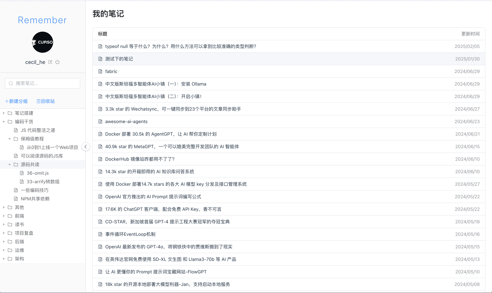

编辑页面

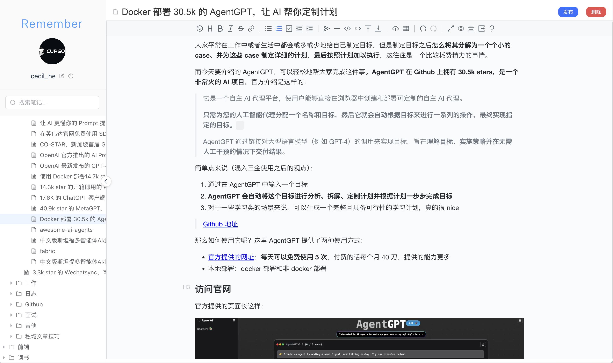

创建知识库

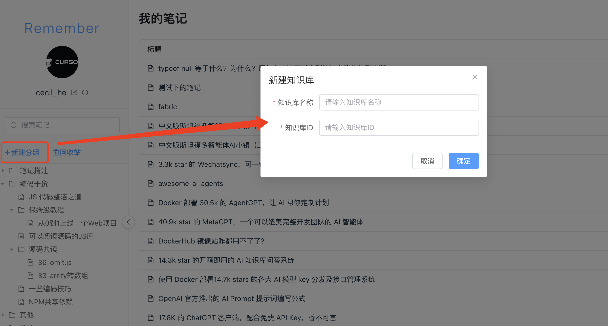

编辑器操作栏，右侧红框依次为：预览、大纲和导出

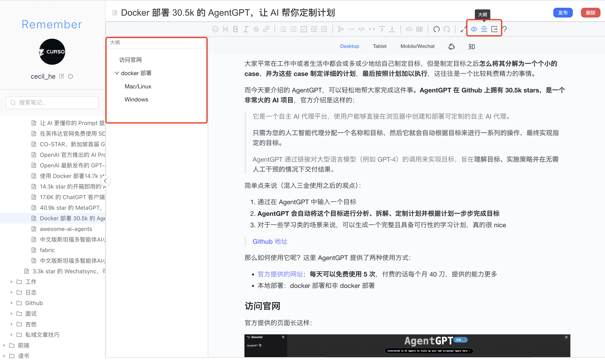

预览

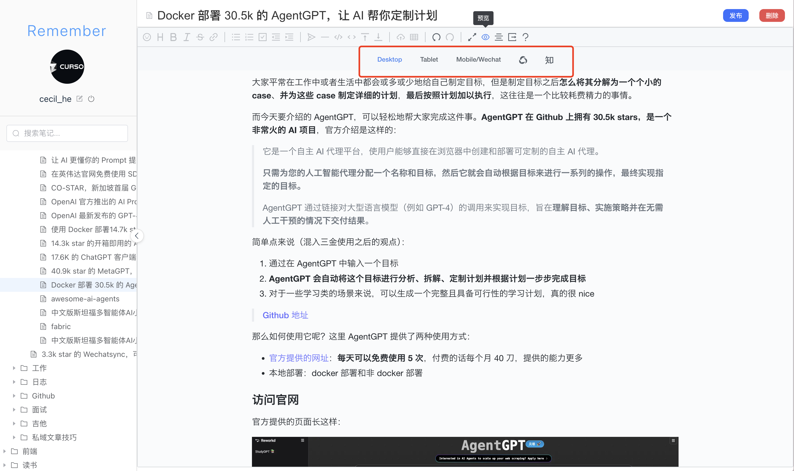

发布笔记到静态站点

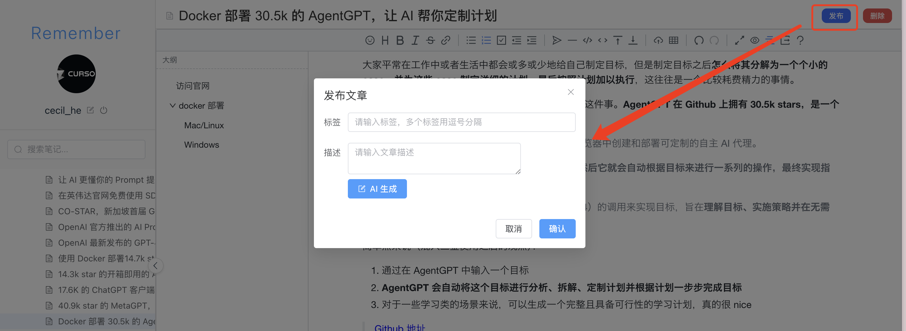

回收站

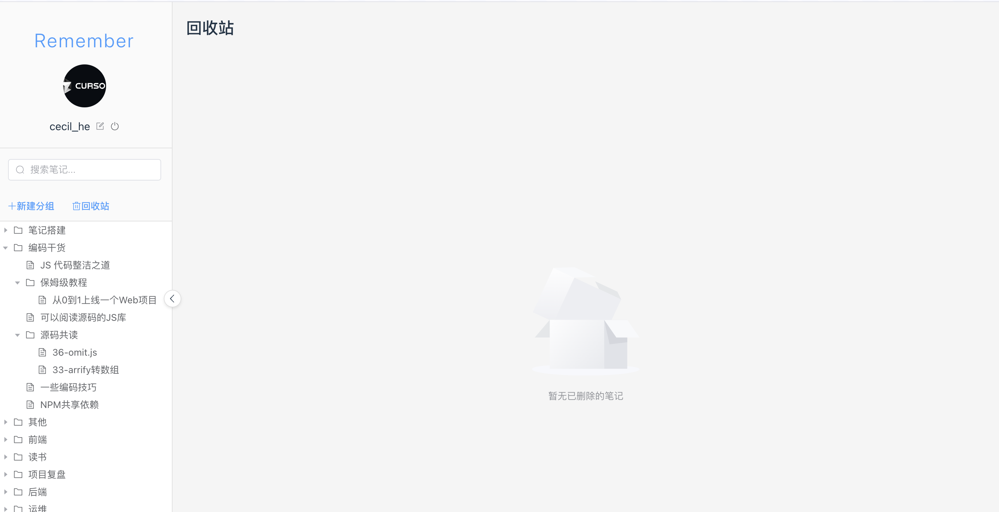

## Github 配置

因为目前 Github 已经不支持用户名密码的形式来访问仓库，所以这里使用 Token 来进行访问。

首先，登录您的 Github，然后点击右上角的头像，选择 `Settings`。

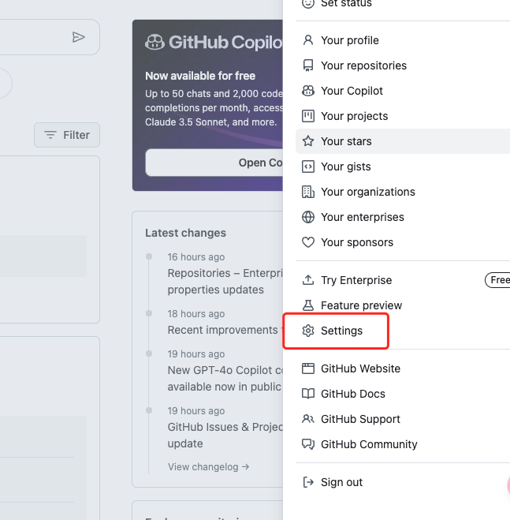

然后，在左侧导航栏中选择 `Developer settings`。

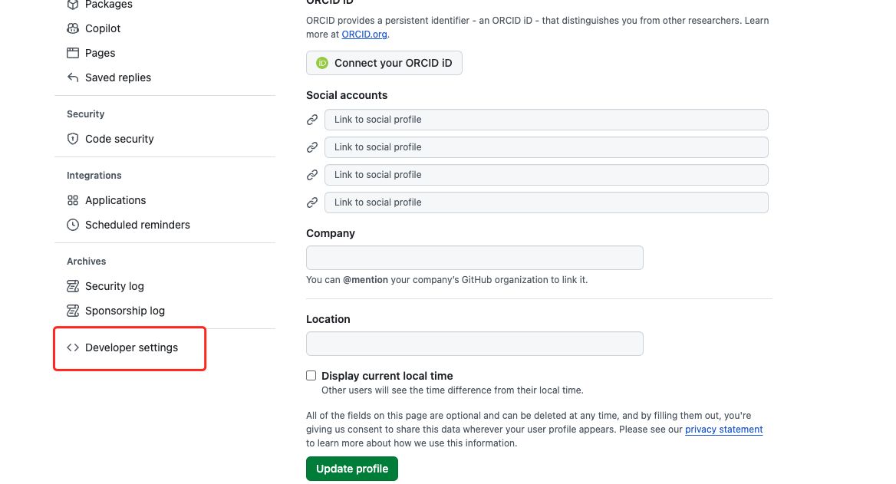

然后，在左侧导航栏中选择 `Personal access tokens`, 然后，点击 `Generate new token`。

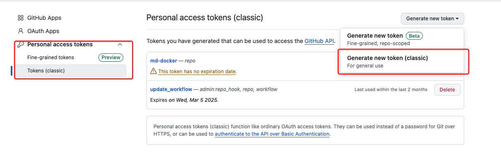

然后，在 `Note` 中填写一个描述，然后在 `Scopes` 中选择 `repo`，然后点击表单最下边的 `Generate token`。

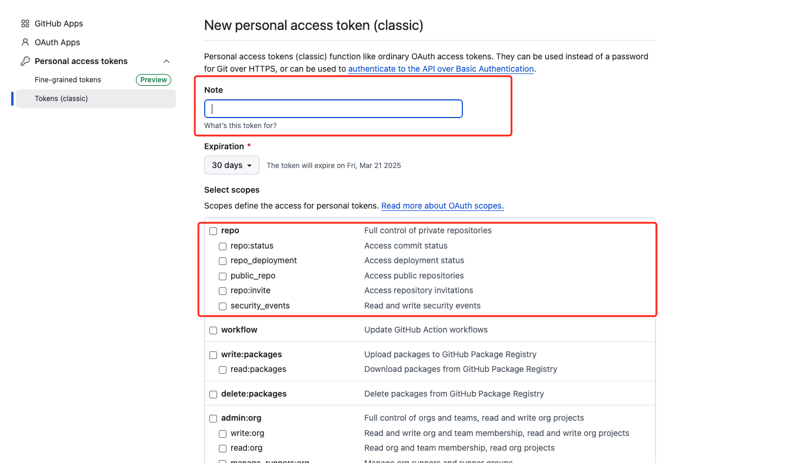

然后，将生成的 Token 复制到 `.env` 文件中。格式为：

```bash
GITHUB_REPO_URL="https://${GITHUB_ACCESS_TOKEN}@github.com/username/repo.git"
```

- GITHUB_ACCESS_TOKEN 就是你刚刚生成的 Token。
- github.com/username/repo.git 就是你的 Github 仓库地址。 

> **⚠️注意**：目前只测试过 hugo 静态站点博客系统，其他的静态站点博客系统还未测试。为了博客安全，请在测试后再配置正式的 Github 仓库地址以及博客路径，防止数据丢失。    

## Tinify API KEY 获取

- 先访问 Tinify 官网： [https://tinypng.com/](https://tinypng.com/)
- 点击菜单栏中的 API 


- 按照截图中红框部分输入对应信息，点击 `Get your API key` 即可。

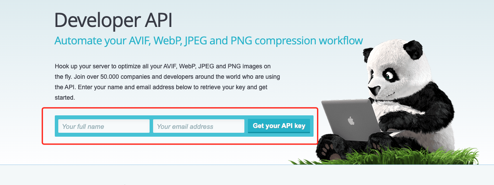

## 阿里云 OSS 配置

使用阿里云 OSS 的原因是会定时进行数据备份，防止数据丢失。

1. 注册及登录阿里云账号，进入 [阿里云 RAM 控制台](https://ram.console.aliyun.com/profile/access-keys) 创建 AccessKey ID 和 AccessKey Secret。
2. 访问[阿里云 OSS 控制台](https://oss.console.aliyun.com/bucket)，并创建 Bucket。
3. 按照 [OSS 文档](https://help.aliyun.com/zh/oss/user-guide/simple-upload#section-ym8-svm-rmu)将 OSS region、AccessKey ID、AccessKey Secret、Bucket 名称填入 `.env` 文件中。

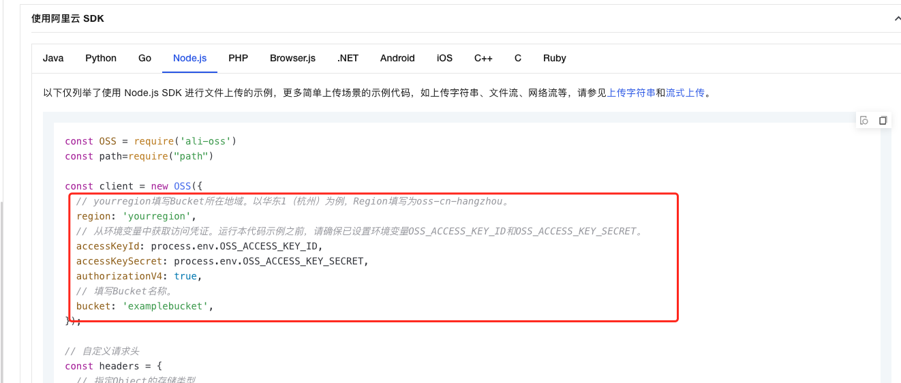


## 编辑器插件

- [Vditor](https://github.com/Vanessa219/vditor)

## 支持作者

如果您觉得这个项目对您有帮助，欢迎给作者一个 Star。

加我微信拉你进交流群：


另外作者也在公众号输出一些 AI 相关的文章，有兴趣的朋友可以关注一下：


如果觉得本项目对您有帮助，也可以请作者喝杯咖啡～


## 开源协议
MIT
